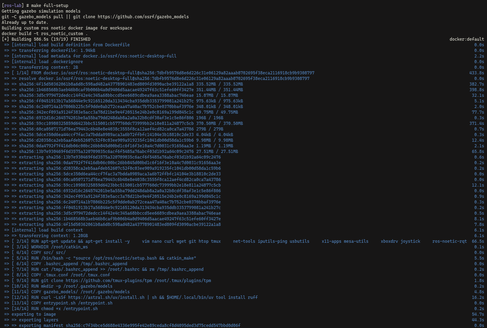
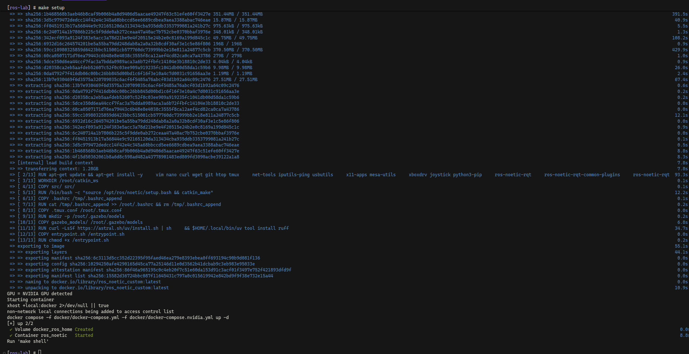
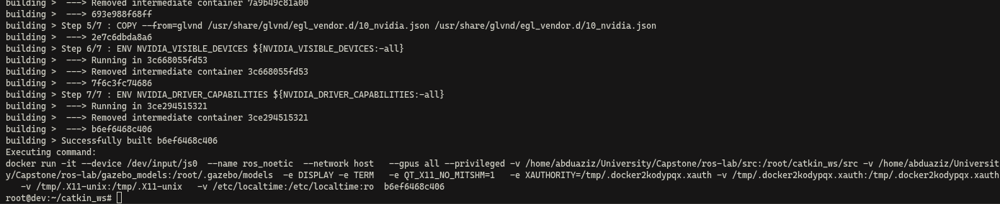
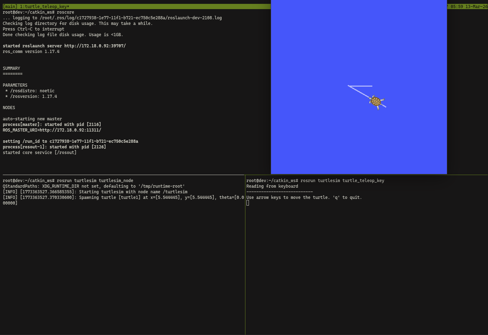
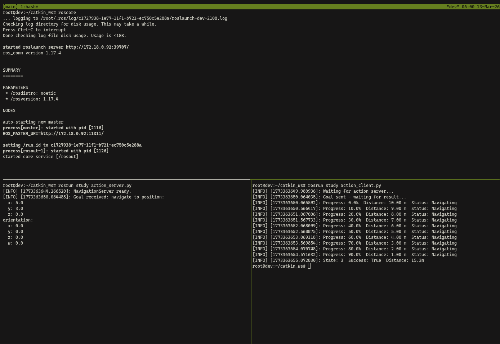
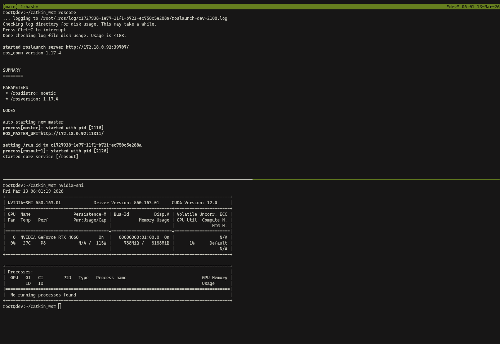
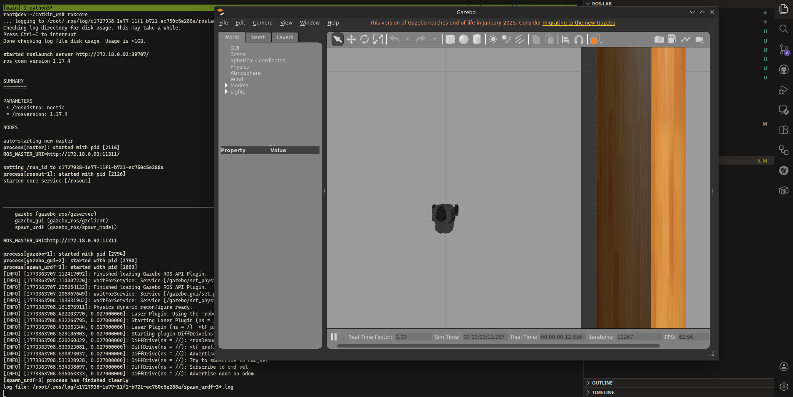
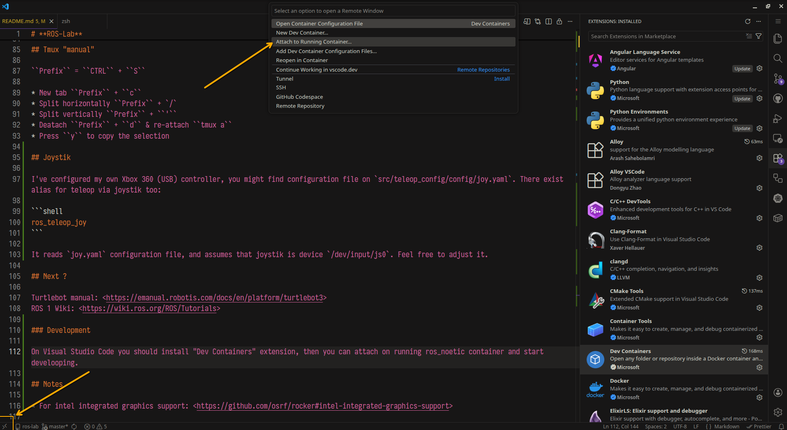
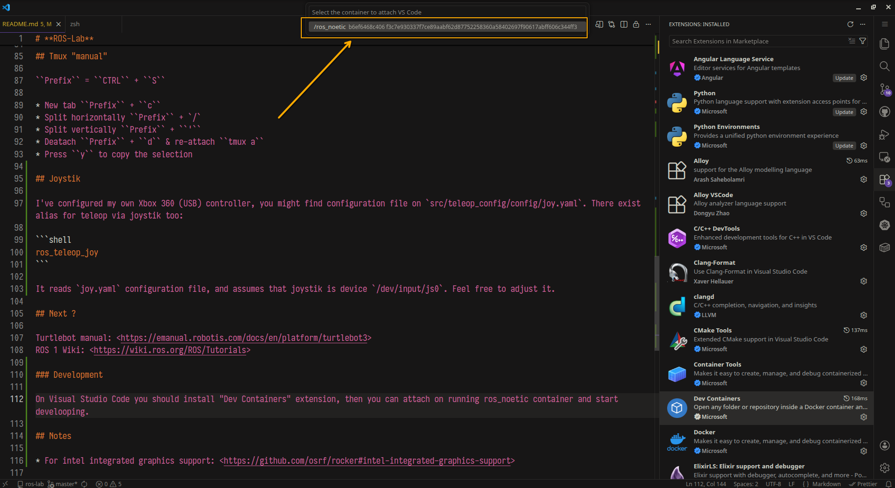
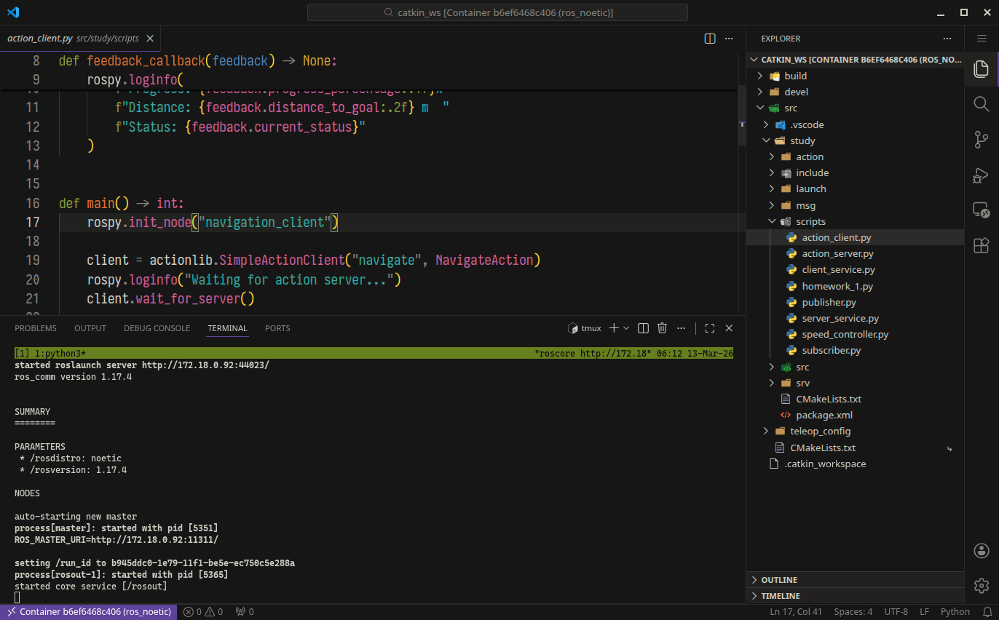

# **ROS-Lab**

<!-- AI-FREE -->
<p align="center">
  <picture>
    <source media="(prefers-color-scheme: dark)" srcset="https://abduaziz.ziyodov.uz/badges/ai-free-dark.svg">
    <source media="(prefers-color-scheme: light)" srcset="https://abduaziz.ziyodov.uz/badges/ai-free-light.svg">
    
  </picture>
</p>

> My approach on setting up ROS development via `docker`.

What's included (notable)

* Full ROS desktop environment with extras, feel free to extend it (see `Dockerfile` ...)
* NVIDIA GPU support via `rocker` for gazebo simulations + "pre-fetching" gazebo models
* Shell(bash) & tmux configuration
* Default package called `study`
* Xbox 360 joystik configuration

Tested o my **Debian 13** (Linux dev 6.12.73+deb13-amd64 #1 SMP PREEMPT_DYNAMIC Debian 6.12.73-1 (2026-02-17) x86_64 GNU/Linux) **Wayland**/**X11** with **Nvidia RTX 4060** PC.

## Setup

Install `docker`: <https://docs.docker.com/engine/install/debian>

`rocker`(see <https://github.com/osrf/rocker>):

via `uv`: <https://docs.astral.sh/uv/getting-started/installation>

```shell
uv tool install rocker
```

or `apt`:

```shell
apt install python3-rocker
```

Install `make` (gnu one?):

```shell
apt install make
```

Clone current repository:

```shell
git clone git@github.com:AbduazizZiyodov/ros-lab.git
```

Trigger `full-setup` command

```shell
make full-setup
```

After all of these setup thing you should get bash shell, and you can run `tmux`. Next, on `tmux` through ``Prefix`` + ``I`` where ``Prefix`` = ``CTRL`` + ``S`` you might want to install tmux plugins.

Now, you should be able to do your experiments! IP address is defaulted into `hostname -I | cut -f1 -d' '` as it runs on `host` network.

You might re-start(if you've exited from it or killed) the `ros_noetic` container, or run `make ros-shell` to gain access on shell inside container.

## Screenshots

Install & setup:




Turtlesim via keyboard teleop:


Run sample script from `study` package (its action demo there):


Check NVIDIA through `nvidia-smi`:


Run gazebo simulation environment (house world):


## Tmux "manual"

``Prefix`` = ``CTRL`` + ``S``

* New tab ``Prefix`` + ``c``
* Split horizontally ``Prefix`` + `/`
* Split vertically ``Prefix`` + ``'``
* Deatach ``Prefix`` + ``d`` & re-attach ``tmux a``
* Press ``y`` to copy the selection

## Joystik

I've configured my own Xbox 360 (USB) controller, you might find configuration file on `src/teleop_config/config/joy.yaml`. There exist alias for teleop via joystik too:

```shell
ros_teleop_joy
```

It reads `joy.yaml` configuration file, and assumes that joystik is device `/dev/input/js0`. Feel free to adjust it.

## Next ?

Turtlebot manual: <https://emanual.robotis.com/docs/en/platform/turtlebot3>
ROS 1 Wiki: <https://wiki.ros.org/ROS/Tutorials>

### Development

On Visual Studio Code you should install "Dev Containers" extension, then you can attach on running ros_noetic container and start develooping.

After installing, attach:




Then it will install Vs Code server on container, after that you should be able to open workspace (its `~/catkin_ws`)


Spawn terminal + tmux, start developing.

## Notes

* For intel integrated graphics support: <https://github.com/osrf/rocker#intel-integrated-graphics-support>

## Known Issue(s)

After restarting the PC:

```shell
[ros-lab] # docker start ros_noetic 
Error response from daemon: failed to create task for container: failed to create shim task: OCI runtime create failed: runc create failed: unable to start container process: error during container init: error mounting "/tmp/.dockeryio10bi4.xauth" to rootfs at "/tmp/.dockeryio10bi4.xauth": mount src=/tmp/.dockeryio10bi4.xauth, dst=/tmp/.dockeryio10bi4.xauth, dstFd=/proc/thread-self/fd/12, flags=MS_BIND|MS_REC: not a directory: Are you trying to mount a directory onto a file (or vice-versa)? Check if the specified host path exists and is the expected type
failed to start containers: ros_noetic
```
