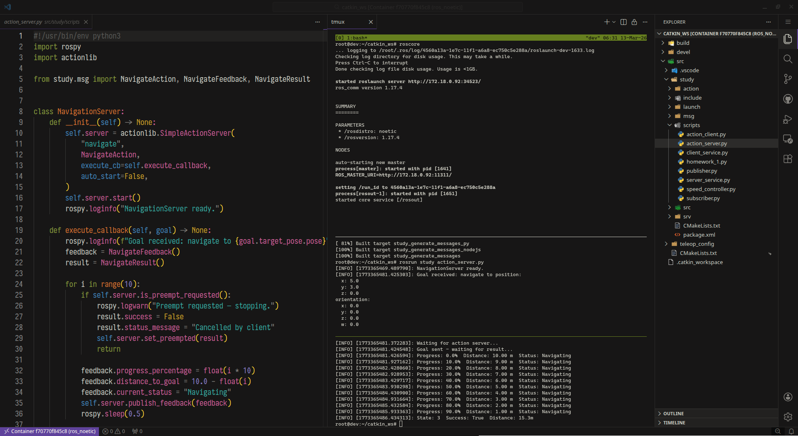
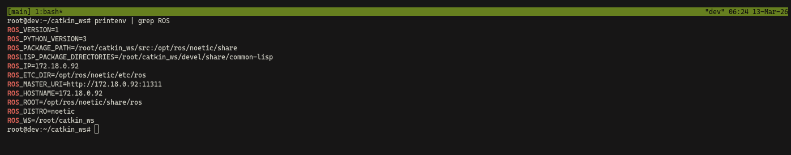

# **ROS 1 (noetic) Lab**



<p align="center">
  <i>"My approach on setting up ROS 1 (noetic) & turtlebot3 (burger) development environment via docker."</i>
</p>

<!-- AI-FREE -->
<p align="center">
  <picture>
    <source media="(prefers-color-scheme: dark)" srcset="https://abduaziz.ziyodov.uz/badges/ai-free-dark.svg">
    <source media="(prefers-color-scheme: light)" srcset="https://abduaziz.ziyodov.uz/badges/ai-free-light.svg">
    
  </picture>
</p>

What's included (notable)

- Full ROS desktop environment with extras, feel free to extend it (see `Dockerfile` ...)
- NVIDIA GPU support via `rocker` for gazebo simulations + "pre-fetching" gazebo models
- Shell(bash) & tmux configuration
- Default package called `study`
- Xbox 360 joystik configuration
- turtlebot3_simulations already included

> [!NOTE]
> Tested o my **Debian 13** (Linux dev 6.12.73+deb13-amd64 #1 SMP PREEMPT_DYNAMIC Debian 6.12.73-1 (2026-02-17) x86_64 GNU/Linux) **Wayland**/**X11** with **Nvidia RTX 4060** PC.

## Setup

Install `docker`: <https://docs.docker.com/engine/install/debian>

`rocker`(see <https://github.com/osrf/rocker>):

via `uv`: <https://docs.astral.sh/uv/getting-started/installation>

```shell
uv tool install rocker
```

or `apt`:

```shell
apt install python3-rocker
```

Install nvidia container toolkit: <https://docs.nvidia.com/datacenter/cloud-native/container-toolkit/latest/install-guide.html#installation>

Install `make` (gnu one?):

```shell
apt install make
```

Clone current repository:

```shell
git clone git@github.com:AbduazizZiyodov/ros-lab.git
```

Setup

```shell
make setup
```

> ![NOTE]
> For non-nvidia option, `rocker` mounts `--devices /dev/dri` for Intel integrated graphics support .

After all of these setup thing you should get bash shell, and you can run `tmux`.

Now, you should be able to do your experiments! IP address is defaulted into `hostname -I | cut -f1 -d' '` as this container runs on `host` network. Environment after the setup:


> ![NOTE]
> Make sure on each restart you run `make shell`, it will autohorize docker on xhost which prevents auth errors when you try to run GUI apps from container.

## Screenshots

Setup then get shell via `make shell`:


Turtlesim via keyboard teleop:


Run sample script from `study` package (its action demo there):


Check NVIDIA through `nvidia-smi`:


Run gazebo simulation environment (house world):


## Tmux "manual"

`Prefix` = `CTRL` + `S`

- New tab `Prefix` + `c`
- Split horizontally `Prefix` + `/`
- Split vertically `Prefix` + `'`
- Deatach `Prefix` + `d` & re-attach `tmux a`
- Press `y` to copy the selection

## Joystik

I've configured my own Xbox 360 (USB) controller, you might find configuration file on `src/teleop_config/config/joy.yaml`. There exist alias for teleop via joystik too:

```shell
ros_teleop_joy
```

It reads `joy.yaml` configuration file, and assumes that joystik is device `/dev/input/js0`. Feel free to adjust it.

## Next ?

Turtlebot manual: <https://emanual.robotis.com/docs/en/platform/turtlebot3>
ROS 1 Wiki: <https://wiki.ros.org/ROS/Tutorials>

### Development (Dev Containers, Attach)

On Visual Studio Code you should install "Dev Containers" extension, then you can attach on running ros_noetic container and start develooping.

After installing, attach:


Then it will install Vs Code server on container, after that you should be able to open workspace (its `~/catkin_ws`)


Spawn terminal + tmux, start developing.

> ![WARNING]
> If you change the host network (e.g. Wi-Fi) connection, you need to "reload" the pre-defined IP address related variables because `roscore` can't serve via older ones. You should run either `ros_reload` or `source ~/.bashrc` from current terminal you're working on.

### Visual Studio Code Extensions

- **Dev Containers** - <https://marketplace.visualstudio.com/items?itemName=ms-vscode-remote.remote-containers>
- **Python** - <https://marketplace.visualstudio.com/items?itemName=ms-python.python>
- **Robot Developer Extensions for ROS 1** - <https://marketplace.visualstudio.com/items?itemName=Ranch-Hand-Robotics.rde-ros-1>
- **C/C++ DevTools** - <https://marketplace.visualstudio.com/items?itemName=ms-vscode.cpp-devtools> - it is required by ROS 1 extension above (as far as I can remember), but I prefer `Clangd` (see below)
- **Clangd** - <https://marketplace.visualstudio.com/items?itemName=llvm-vs-code-extensions.vscode-clangd>

## Known Issue(s)
